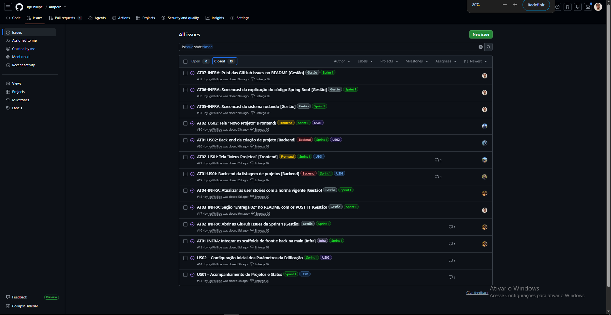

# AMPERE — Automação e Modelagem para Projetos de Energia em Redes Edificadas

O AMPERE automatiza o cálculo de demanda elétrica em edificações com múltiplas unidades consumidoras, aplicando de forma padronizada as regras normativas vigentes da Neoenergia Pernambuco. A ferramenta modela a rede elétrica do projeto, elimina erros de interpretação das normas e reduz o índice de reprovação de projetos por falhas de cálculo.

---

## Visão Geral

Cerca de 50 % dos aproximadamente 1.400 projetos elétricos de edificações com múltiplas unidades consumidoras recebidos anualmente pela Neoenergia Pernambuco são reprovados por erros no cálculo de demanda. A complexidade das tabelas, parâmetros e regras normativas aumenta a probabilidade de equívocos tanto dos clientes quanto das equipes de análise.

A solução automatiza esse cálculo aplicando as regras normativas vigentes de forma padronizada, eliminando erros de interpretação e reduzindo o índice de reprovação de projetos.

Mais detalhes em [`docs/negocio/premissas-desafio.md`](docs/negocio/premissas-desafio.md).

---

## Tecnologias

| Camada | Tecnologia | Papel no projeto |
| :--- | :--- | :--- |
| Back-end | Java + Spring Boot | API REST e motor de cálculo de demanda com classes de domínio |
| Banco de dados | PostgreSQL | Entidades persistidas e parâmetros normativos versionados por revisão |
| Front-end | React + Vite | Interface do projetista e do analista, consumindo a API |
| Prototipação | Figma | Protótipos Lo-Fi e Hi-Fi das telas dos dois perfis |
| Documentação | Markdown | Registro de decisões, normas e processo, versionado junto com o código |
| Gestão | Trello e GitHub Issues | Backlog, issues e acompanhamento semanal |

Detalhamento por camada: [`app/back/README.md`](app/back/README.md) · [`app/front/README.md`](app/front/README.md) · [`docs/tecnico/README.md`](docs/tecnico/README.md)

---

## Descoberta e análise

O projeto é dividido em três fases — **Imersão**, **Ideação** e **Desenvolvimento do MVP** ([`docs/processo.md`](docs/processo.md)). A Imersão está concluída e produziu:

| Documento | O que traz |
| :--- | :--- |
| [Premissas do desafio](docs/negocio/premissas-desafio.md) | O desafio como a Neoenergia PE o apresentou: problema, impacto e proposta de solução. |
| [Análise de causa raiz](docs/negocio/analise-causa-raiz.md) | 5 Porquês e Ishikawa — por que os projetos são reprovados, até a causa raiz. |
| [Benchmarking](docs/negocio/benchmarking.md) | O que COPEL, CEMIG, Enel, CPFL e AltoQi fazem, comparados em 9 critérios. Ninguém junta cálculo e aprovação. |
| [Objetivos do projeto](docs/produto/objetivos-projeto.md) | O que o MVP precisa alcançar e como isso responde à descoberta. |
| [Mapa de stakeholders](docs/negocio/mapa-stakeholders.md) | Quem é afetado, por grau de proximidade e posição dentro/fora da Neoenergia. |
| [Processo de submissão](docs/negocio/processo-submissao.md) | Como o projeto chega hoje à Neoenergia, é analisado e volta ao projetista. |
| [Fontes normativas](docs/tecnico/fontes-normativas.md) | A DIS-NOR-053, a metodologia de cálculo e o processo de submissão atual. |
| [Questões em aberto](docs/produto/questoes-em-aberto.md) | O que ainda falta decidir para transformar os objetivos em requisitos construíveis. |

---

## Deploy

| Ambiente | URL |
| :--- | :--- |
| Front-end | TBD |
| Back-end (API) | TBD |

---

## Como rodar o projeto

Os dois scaffolds já estão no repositório — sem telas nem classes de domínio, mas rodando.

**Back-end** (Java 21, Spring Boot, PostgreSQL). Precisa de Docker:

```bash
cd app/back && cp .env.example .env && docker compose up
```

A API sobe em `http://localhost:8080/api` e a documentação em `/api/docs`. Com a JDK 21 instalada dá para rodar a aplicação localmente contra o banco em container, o que é mais rápido no dia a dia. Detalhes em [app/back/README.md](app/back/README.md).

**Front-end** (React 19, Vite, TypeScript). Precisa de Node 24+ e pnpm:

```bash
cd app/front && cp .env.example .env && pnpm install && pnpm dev
```

Sobe em `http://localhost:5173` e faz proxy de `/api` para o back-end. O login ainda responde contra o MSW, porque a autenticação depende de uma questão de produto em aberto. Detalhes, credenciais de teste e comandos em [app/front/README.md](app/front/README.md).

---

## Entregas

| Entrega | Data | Situação |
| :--- | :--- | :--- |
| Entrega 01 | 31/08/2026 | Finalizada |
| Entrega 02 | 21/09/2026 | Não iniciada |
| Entrega 03 | 19/10/2026 | Não iniciada |
| Entrega 04 | 09/11/2026 | Não iniciada |

Critérios de cada marco: [`docs/cronograma-poo.md`](docs/cronograma-poo.md) (POO) e [`docs/cronograma-projetos3.md`](docs/cronograma-projetos3.md) (Projetos 3).

### Entrega 01 — 31/08/2026

Fase inicial focada na estruturação de requisitos, validação de negócio e especificação da experiência do usuário:
- **Histórias de Usuário (7 USs completas):** Especificadas no documento [`docs/produto/user-stories.md`](docs/produto/user-stories.md) com detalhes de negócio na descrição, regras de interface e cenários de validação com entrega de valor usando **BDD (Dado/Quando/Então)**.
- **Protótipo Lo-Fi (Figma):** Interface completa cobrindo a jornada dos dois perfis em todas as 7 histórias de usuário mapeadas (mínimo de 5 exigidas).
- **Screencast do Protótipo (YouTube):** Vídeo gravado apresentando o protótipo no Figma e explicando cada história implementada (com áudio/legenda).

| Artefato | Link |
| :--- | :--- |
| Histórias de usuário | [`docs/produto/user-stories.md`](docs/produto/user-stories.md) |
| Protótipo Lo-Fi | [Figma — Protótipo LO-FI](https://www.figma.com/design/gSwTyjY0iSzmDNAe4s6XeE/Prot%C3%B3tipo-LO-FI?node-id=18-4) |
| Screencast do protótipo | [YouTube — Screencast do Protótipo](https://youtu.be/OI0QDboGtk4) |

**Histórias e telas correspondentes**

| História | Título | Perfil | Telas no protótipo Hi-Fi |
| :---: | :--- | :---: | :--- |
| [US01](docs/produto/user-stories.md#us01--acompanhamento-de-projetos-e-status) | [Acompanhamento de projetos e status](docs/produto/user-stories.md#us01--acompanhamento-de-projetos-e-status) | Projetista | [H1 · Meus projetos](https://www.figma.com/design/tbMeH3sx9YwDVb6oz7bCBG/Prot%C3%B3tipo-HI-FI?node-id=2037-2) · [H1a · busca sem resultados](https://www.figma.com/design/tbMeH3sx9YwDVb6oz7bCBG/Prot%C3%B3tipo-HI-FI?node-id=2118-2) · [H1b · detalhes](https://www.figma.com/design/tbMeH3sx9YwDVb6oz7bCBG/Prot%C3%B3tipo-HI-FI?node-id=2155-2) |
| [US02](docs/produto/user-stories.md#us02--configuração-inicial-dos-parâmetros-da-edificação) | [Configuração inicial dos parâmetros da edificação](docs/produto/user-stories.md#us02--configuração-inicial-dos-parâmetros-da-edificação) | Projetista | [H2 · Novo projeto](https://www.figma.com/design/tbMeH3sx9YwDVb6oz7bCBG/Prot%C3%B3tipo-HI-FI?node-id=2042-2) |
| [US03](docs/produto/user-stories.md#us03--cadastro-e-validação-em-tempo-real-de-unidades-consumidoras) | [Cadastro e validação em tempo real de UCs](docs/produto/user-stories.md#us03--cadastro-e-validação-em-tempo-real-de-unidades-consumidoras) | Projetista | [H3 · Unidades consumidoras](https://www.figma.com/design/tbMeH3sx9YwDVb6oz7bCBG/Prot%C3%B3tipo-HI-FI?node-id=2044-2) · [H3a · adicionar grupo](https://www.figma.com/design/tbMeH3sx9YwDVb6oz7bCBG/Prot%C3%B3tipo-HI-FI?node-id=2152-2) |
| [US04](docs/produto/user-stories.md#us04--conferência-do-cálculo-passo-a-passo-da-demanda) | [Conferência do cálculo passo a passo da demanda](docs/produto/user-stories.md#us04--conferência-do-cálculo-passo-a-passo-da-demanda) | Projetista | [H4 · Cálculo de demanda](https://www.figma.com/design/tbMeH3sx9YwDVb6oz7bCBG/Prot%C3%B3tipo-HI-FI?node-id=2032-2) |
| [US05](docs/produto/user-stories.md#us05--geração-de-memorial-e-envio-do-projeto) | [Geração de memorial e envio do projeto](docs/produto/user-stories.md#us05--geração-de-memorial-e-envio-do-projeto) | Projetista | [H5 · Memorial](https://www.figma.com/design/tbMeH3sx9YwDVb6oz7bCBG/Prot%C3%B3tipo-HI-FI?node-id=2045-2) · [H5b · envio concluído](https://www.figma.com/design/tbMeH3sx9YwDVb6oz7bCBG/Prot%C3%B3tipo-HI-FI?node-id=2147-2) |
| [US06](docs/produto/user-stories.md#us06--fila-de-análise-técnica-priorizada) | [Fila de análise técnica priorizada](docs/produto/user-stories.md#us06--fila-de-análise-técnica-priorizada) | Analista | [H6 · Fila de análise](https://www.figma.com/design/tbMeH3sx9YwDVb6oz7bCBG/Prot%C3%B3tipo-HI-FI?node-id=2082-2) |
| [US07](docs/produto/user-stories.md#us07--auditoria-de-memória-e-registro-pontual-de-apontamentos) | [Auditoria de memória e registro de apontamentos](docs/produto/user-stories.md#us07--auditoria-de-memória-e-registro-pontual-de-apontamentos) | Analista | [H7 · Análise do projeto](https://www.figma.com/design/tbMeH3sx9YwDVb6oz7bCBG/Prot%C3%B3tipo-HI-FI?node-id=2083-2) · [H8 · histórico do protocolo](https://www.figma.com/design/tbMeH3sx9YwDVb6oz7bCBG/Prot%C3%B3tipo-HI-FI?node-id=2085-2) |

### Entrega 02 — 21/09/2026

Fase focada na implementação inicial, contando com ambiente de versionamento atuante por meio de commits frequentes (semanais e de código) aplicados diretamente na branch `main`. O sistema de issue/bug tracker foi atualizado e utilizado em todas as semanas correspondentes à entrega. 

#### Histórias implementadas

Abaixo constam as descrições em formato POST-IT das duas histórias implementadas nesta entrega, que contaram com tarefas no Back-end e no Front-end:

**US01 — Acompanhamento de Projetos e Status**
* **Como:** Projetista
* **Quero:** Visualizar uma listagem com todos os meus projetos e seus respectivos status
* **Para:** Que eu consiga acompanhar e gerenciar o andamento das minhas submissões.

**US02 — Configuração Inicial dos Parâmetros da Edificação**
* **Como:** Projetista
* **Quero:** Inserir os parâmetros e configurações básicas ao iniciar um novo projeto
* **Para:** Começar a etapa de cadastro e avançar posteriormente para o cálculo de demanda da edificação.

| Artefato | Link |
| :--- | :--- |
| Histórias implementadas (POST-IT) | Descritas na seção acima |
| Print do GitHub Issues |  |
| Screencast do sistema rodando (YouTube) | [Apresentação Parte 1](https://youtu.be/YMnBWUuncdQ) <br> [Apresentação Parte 2](https://youtu.be/6X58x5Wv9ho) |
| Screencast da explicação do código (YouTube) | [Explicação do Código Spring Boot 1](https://youtu.be/_4FRXZAnfkg) ([Explicação do Código Spring Boot 1](https://youtu.be/_nDhOTqJTPY)). |

### Entrega 03 — 19/10/2026

Mais 2 histórias implementadas, com os mesmos artefatos de acompanhamento.

| Artefato | Link |
| :--- | :--- |
| Histórias implementadas (POST-IT) | TBD |
| Print do GitHub Issues | TBD |
| Screencast do sistema com as novas histórias | TBD |
| Screencast da explicação do código | TBD |

### Entrega 04 — 09/11/2026

Histórias restantes e fechamento do produto para a apresentação final.

| Artefato | Link |
| :--- | :--- |
| Histórias implementadas (POST-IT) | TBD |
| Print do GitHub Issues | TBD |
| Screencast final do sistema | TBD |
| Screencast da explicação do código | TBD |

---

## Links importantes

| Área | Link |
| :--- | :--- |
| Deploy (front) | TBD |
| Deploy (API) | TBD |
| Site do grupo | [Google Sites](https://sites.google.com/cesar.school/site-grupo-4/) |
| Backlog e progresso | [GitHub Project — AMPERE Sprint 1](https://github.com/users/IgrPhillipe/projects/4) |
| Issues | [GitHub Issues](https://github.com/IgrPhillipe/ampere/issues) · [milestone Entrega 02](https://github.com/IgrPhillipe/ampere/milestone/1) |
| Gestão do projeto | [Trello](https://trello.com/b/yd35ygrF/cesar-projetos-3) |
| Ideação | [FigJam](https://www.figma.com/board/H7ZlU9nAbR72LiXVLUBmqo) |
| Figma (descoberta) | [Figma](https://www.figma.com/files/team/1541129127160121770/project/636750169?fuid=1543015890914897932) |
| Protótipo Hi-Fi | [Figma — Protótipo HI-FI](https://www.figma.com/design/tbMeH3sx9YwDVb6oz7bCBG/Prot%C3%B3tipo-HI-FI) |
| Protótipo Lo-Fi | [Figma — Protótipo LO-FI](https://www.figma.com/design/gSwTyjY0iSzmDNAe4s6XeE/Prot%C3%B3tipo-LO-FI?node-id=18-4) |
| Drive | [Google Drive](https://drive.google.com/drive/u/1/folders/13xm3xImWBu0tH-wV9_ENizb65mgrkQ3l) |
| Cronograma (Projetos 3) | [`docs/cronograma-projetos3.md`](docs/cronograma-projetos3.md) |
| Cronograma (POO) | [`docs/cronograma-poo.md`](docs/cronograma-poo.md) |

---

## Equipe e Papéis

| Nome | Papel | E-mail | Entrada | Saída | LinkedIn | GitHub |
| :--- | :--- | :--- | :--- | :--- | :--- | :--- |
| _Afonso Araujo_ | Engenheiro de Dados | ahma@cesar.school | 08/08/2026 | — | [LinkedIn](https://www.linkedin.com/in/afonso-araujo-8ab810369/) | [GitHub](https://github.com/araujo1901mx) |
| _André Montenegro_ | Dev FullStack | agmos@cesar.school | 08/08/2026 | — | [LinkedIn](https://www.linkedin.com/in/andr%C3%A9-montenegro-420132391/) | [GitHub](https://github.com/andre4383) |
| _Gabriel Boeckmann_ | Dev FullStack | gabs@cesar.school | 08/09/2026 | — | [LinkedIn](https://www.linkedin.com/in/gabriel-araujo-boeckmann-e-silva/) | [GitHub](https://github.com/bielabs) |
| _Igor Aragão_ | Tech Lead & Dev FullStack | ipara@cesar.school | 08/08/2026 | — | [LinkedIn](https://www.linkedin.com/in/igrphillipe/) | [GitHub](https://github.com/IgrPhillipe) |
| _Jean Augusto_ | Dev FullStack | jasm2@cesar.school | 08/08/2026 | — | [LinkedIn](https://www.linkedin.com/in/jean-augusto-0562953b4/) | [GitHub](https://github.com/jeanaugustox) |
| _Kellwen Costa_ | Dev Back-End | kilc@cesar.school | 08/08/2026 | — | [LinkedIn](https://www.linkedin.com/in/kellwencosta/) | [GitHub](https://github.com/kellwencosta) |
| _Lucas Gabriel_ | Dev FullStack | lgcs2@cesar.school | 08/08/2026 | — | [LinkedIn](https://www.linkedin.com/in/lucasgabrielcs/) | [GitHub](https://github.com/lucasgabrielcs) |
| _Williams Pontes_ | Product Owner & Dev Back-End | jwlp@cesar.school | 08/08/2026 | — | [LinkedIn](https://www.linkedin.com/in/williams-pontes/) | [GitHub](https://github.com/WillPontes) |

---

Este projeto faz parte das disciplinas **Projetos 3** e **Programação Orientada a Objetos** — CESAR School, 2026.2.  
Empresa parceira: **Neoenergia Pernambuco** (grupo Iberdrola).
